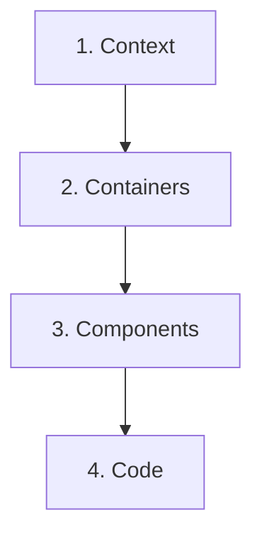

C4 is a way to draw a software system. Instead of one huge diagram with everything in it, you make a few diagrams, each one with a different level of detail. It works like a map: first the country, then the city, then the street.

## The four levels

**1. Context.** The system as one box, with the users and other systems around it. It shows what the system is and who uses it.

**2. Containers.** I open the box and see the parts that run on their own: a web app, an API, a database. It shows how they talk to each other.

**3. Components.** I open one container and see the pieces inside it and how they interact.

**4. Code.** The classes and interfaces behind a component.

## How to build one

I go from the outside in:

1. Define the context: gather requirements and decide what is outside the system.
2. Break the system into containers and map how they relate.
3. Break each container into components and map how they interact.
4. Detail the code, only where it's worth it.

## Good practices

- Be consistent in how you draw.
- Choose the level of detail and stay at it.
- Build the diagrams with the team.
- Refine them in iterations.
- Add titles and descriptions.
- Share what you learn.

## What I take from this

Pick the level that fits who you are talking to, and stop there. A diagram that tries to show everything helps nobody.

## References

- [The C4 model](https://c4model.com/)
