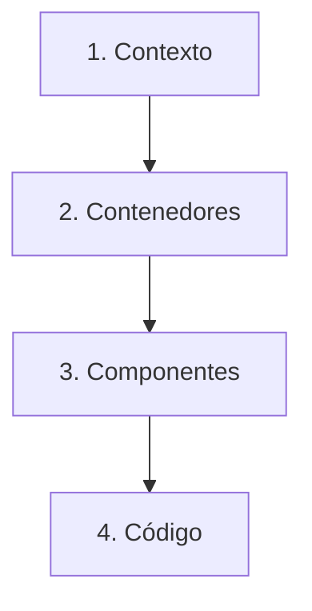

C4 es una forma de dibujar un sistema de software. En lugar de un solo diagrama enorme con todo adentro, haces varios diagramas, cada uno con un nivel de detalle distinto. Funciona como un mapa: primero el país, luego la ciudad y al final la calle.

## Los cuatro niveles

**1. Contexto.** El sistema como una sola caja, con los usuarios y los otros sistemas a su alrededor. Muestra qué es el sistema y quién lo usa.

**2. Contenedores.** Abro la caja y veo las partes que se ejecutan por sí solas: una app web, una API, una base de datos. Muestra cómo se comunican entre sí.

**3. Componentes.** Abro un contenedor y veo las piezas que tiene dentro y cómo interactúan.

**4. Código.** Las clases e interfaces detrás de un componente.

## Cómo construir uno

Voy de afuera hacia adentro:

1. Defino el contexto: reúno los requisitos y decido qué queda fuera del sistema.
2. Divido el sistema en contenedores y mapeo cómo se relacionan.
3. Divido cada contenedor en componentes y mapeo cómo interactúan.
4. Detallo el código, solo donde valga la pena.

## Buenas prácticas

- Ser consistente en la forma de dibujar.
- Elegir el nivel de detalle y mantenerse en él.
- Construir los diagramas con el equipo.
- Refinarlos en iteraciones.
- Agregar títulos y descripciones.
- Compartir lo que aprendes.

## Lo que me llevo de esto

Elige el nivel que le sirva a la persona con la que estás hablando y detente ahí. Un diagrama que intenta mostrarlo todo no le sirve a nadie.

## Referencias

- [The C4 model](https://c4model.com/)
