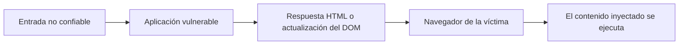
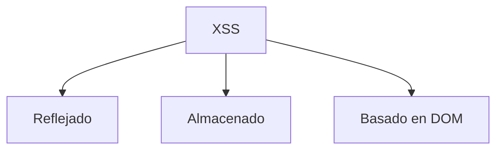
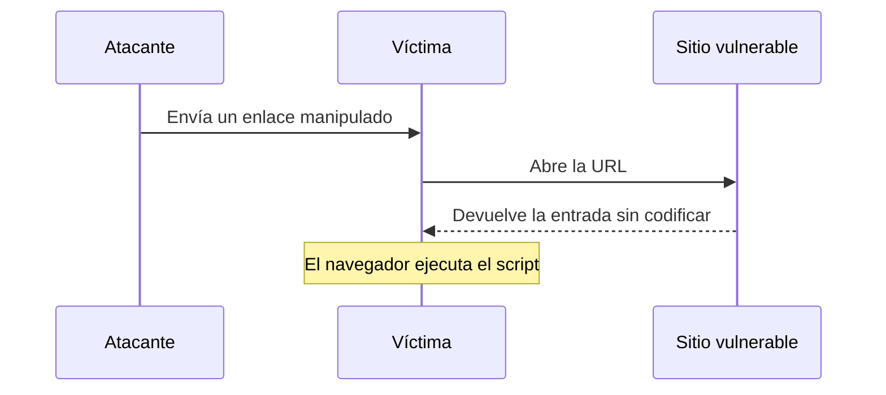
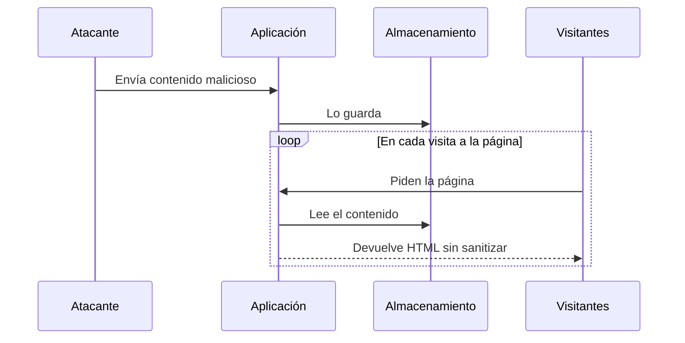
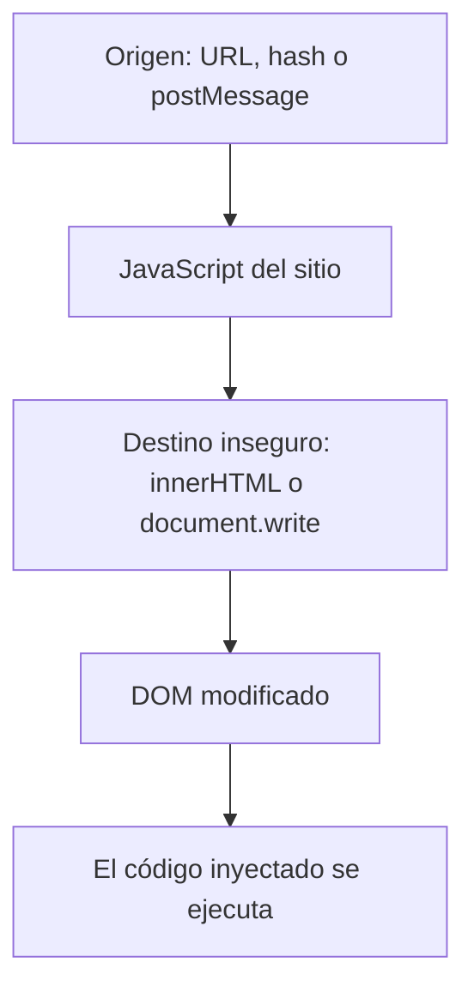
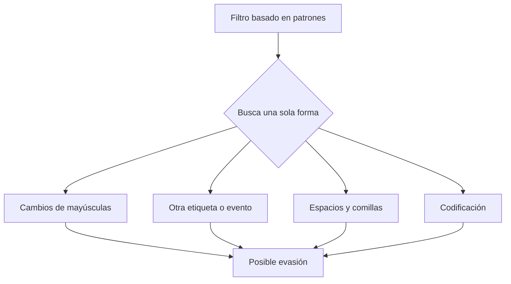
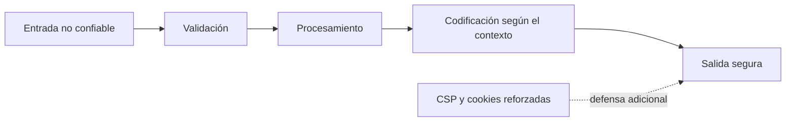

Últimamente he estado estudiando seguridad web, y XSS es el tema que más me hizo detenerme a pensar. Para entenderlo mejor construí un repo pequeño con una demo por cada idea: [devtalks-xss](https://github.com/orfloresti/devtalks-xss). Estas son mis notas, escritas tal como las entendí.

:::warning
Las demos son vulnerables a propósito. Ejecútalas solo en tu propia máquina, nunca las despliegues, y prueba únicamente en sistemas donde tengas permiso de hacerlo.
:::

## Qué es

El navegador no puede distinguir qué partes de una página las escribió el desarrollador y cuáles vienen de un usuario. Si una app mete datos del usuario en una página sin tratarlos antes, el navegador los ejecuta como si fueran parte del sitio. Eso es XSS.

Siempre sigue el mismo camino: la app recibe algo que controla un usuario, lo pone en la página y el navegador lo ejecuta.

Cambiar cómo se ve una página no basta para llamarlo XSS. Eso es inyección de HTML. Solo es XSS cuando realmente se ejecuta código.

## Los tres tipos

**Reflejado.** El servidor devuelve la entrada tal cual en la respuesta. No se guarda nada, así que la víctima tiene que abrir un enlace preparado o enviar un formulario preparado. En mi demo (`01-reflected`) es una sola página con un input: lo que escriba va directo a la página con `innerHTML`, sin sanitizar.

**Almacenado.** La entrada se guarda, y cada visitante que la carga la ejecuta. Este es el que más miedo me da porque nadie tiene que hacer clic en nada. Mi demo (`02-stored`) es un chat pequeño con Express y SQLite. Los mensajes se guardan tal como llegan y se muestran con `innerHTML`, así que un solo mensaje malicioso se dispara para todos los que abran la página.

**Basado en DOM.** Todo ocurre en el navegador. El JavaScript del propio sitio toma datos de un lugar no confiable, como la URL, y los escribe en un lugar que interpreta HTML. El servidor nunca lo ve, así que sus logs ayudan poco. Mi demo (`03-dom-based`) es un router diminuto del lado del cliente que lee el nombre de la sección desde `location.hash` y lo escribe con `innerHTML`. La parte de la URL después del `#` nunca se envía al servidor, así que todo sucede en el navegador.

## Los filtros no te salvan

Mi primera idea fue simplemente bloquear las palabras peligrosas. No funciona. HTML y JavaScript pueden decir lo mismo de muchas maneras, así que una lista de bloqueo siempre deja algo fuera.

## Lo que obtiene el atacante

El código se ejecuta como el sitio, así que puede hacer lo que el sitio puede hacer. Puede leer lo que muestra la página, modificarla, actuar como el usuario o robar una sesión si la cookie está expuesta. Mientras más privilegios tenga la víctima, peor es. Otras dos demos muestran cómo XSS se combina con otras fallas:

- **XSS + CSRF** (`04-xss-csrf`). Una sección de comentarios con XSS almacenado llama en silencio a un endpoint que cambia el correo de la víctima. Como el script corre dentro del sitio, el navegador envía la sesión de la víctima y el endpoint no tiene un token CSRF que lo detenga. Incluso con un token, un script que corre en la misma página podría leerlo.
- **XSS + SSRF** (`05-xss-ssrf`). Una función de "vista previa de URL" hace que el servidor consulte cualquier URL. Sin una lista de permitidos, puede llegar a un servicio interno que nunca debió ser público, y luego muestra la respuesta con `innerHTML`. Dos fallas que se alimentan entre sí.

## Lo que realmente te protege

Ninguna cosa por sí sola basta, así que lo pienso en capas:

1. Codifica la salida según el lugar al que va.
2. Evita los destinos inseguros del DOM. Usa `textContent`.
3. Si tienes que permitir HTML, usa un sanitizador mantenido. No escribas el tuyo.
4. Agrega una Content Security Policy.
5. Marca las cookies de sesión como `HttpOnly`, `Secure` y `SameSite`.
6. Valida la entrada, pero nunca dependas solo de eso.
7. Usa plantillas que escapen por defecto.

Para las demos encadenadas, arregla primero el XSS. Después agrega tokens CSRF y revisa `Origin` en los endpoints que cambian estado. Para SSRF, define una lista de URLs que el servidor puede consultar, bloquea los rangos de IP privadas y nunca muestres contenido consultado con `innerHTML`.

## Lo que me llevo de esto

El objetivo no es reconocer todos los payloads posibles. Es asegurarte de que los datos nunca se traten como código. Codifica a la salida y agrega capas detrás.

Puedes ejecutar las cinco demos desde el [repo](https://github.com/orfloresti/devtalks-xss). Romper algo a propósito me enseñó más que leer sobre ello.

## Referencias

- [devtalks-xss: mis cinco demos](https://github.com/orfloresti/devtalks-xss)
- [OWASP XSS Prevention Cheat Sheet](https://cheatsheetseries.owasp.org/cheatsheets/Cross_Site_Scripting_Prevention_Cheat_Sheet.html)
- [OWASP DOM based XSS Prevention Cheat Sheet](https://cheatsheetseries.owasp.org/cheatsheets/DOM_based_XSS_Prevention_Cheat_Sheet.html)
- [OWASP XSS Filter Evasion Cheat Sheet](https://cheatsheetseries.owasp.org/cheatsheets/XSS_Filter_Evasion_Cheat_Sheet.html)
