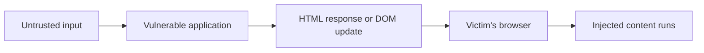
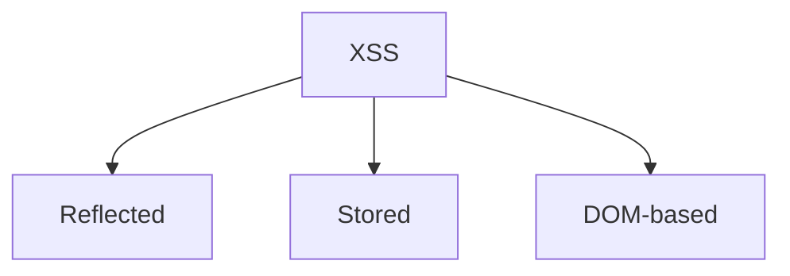
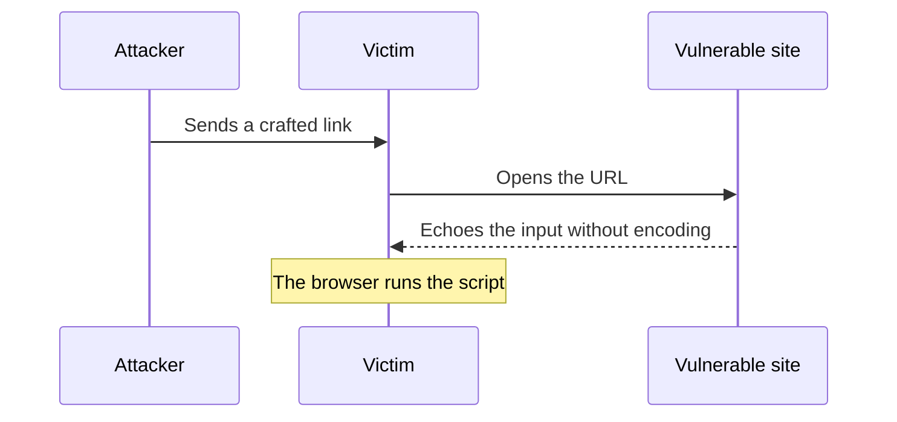
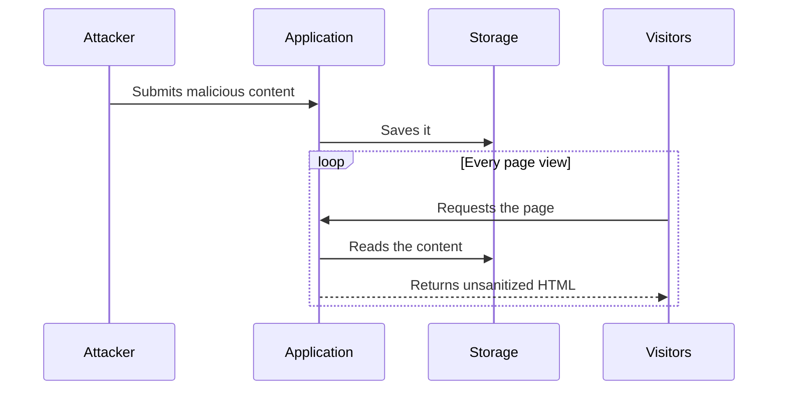
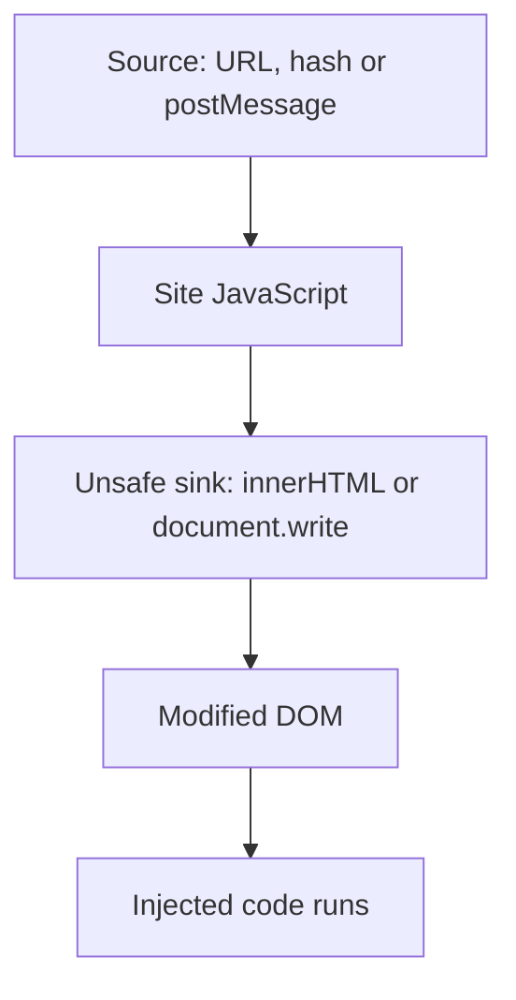
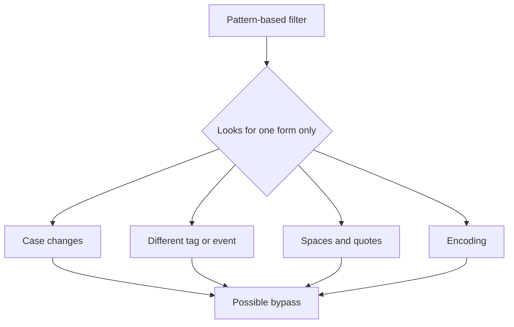
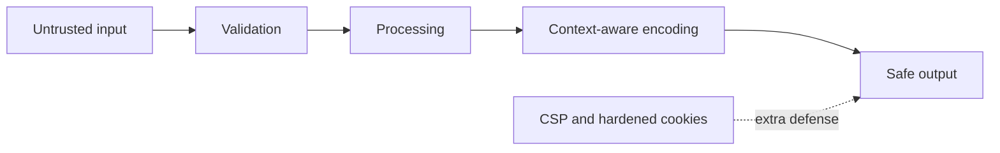

I have been studying web security lately, and XSS is the one that made me stop and think the most. These are my notes, written the way I understood them.

:::note
Only test this on labs or systems you have permission to test.
:::

## What it is

The browser can't tell which parts of a page were written by the developer and which ones came from a user. If an app puts user data into a page without treating it first, the browser runs it as if it were part of the site. That's XSS.

It always goes the same way: the app receives something a user controls, puts it in the page, and the browser runs it.

Changing how a page looks is not enough to call it XSS. That is HTML injection. It is XSS only when code actually runs.

## The three kinds

**Reflected.** The server sends the input right back in the response. Nothing is saved, so the victim has to open a prepared link or submit a prepared form.

**Stored.** The input gets saved, and every visitor who loads it runs it. This one scares me the most because nobody has to click anything.

**DOM-based.** Everything happens in the browser. The site's own JavaScript takes data from somewhere untrusted, like the URL, and writes it into a place that reads HTML. The server never sees it, so its logs don't help much.

## Filters don't save you

My first thought was to just block the dangerous words. It doesn't work. HTML and JavaScript can say the same thing in many ways, so a blocklist always misses something.

## What the attacker gets

The code runs as the site, so it can do what the site can do. It can read what the page shows, change the page, act as the user, or steal a session if the cookie is exposed. It can even get around CSRF tokens, because it reads them from the same page. The more privileges the victim has, the worse it gets.

## What actually protects you

No single thing is enough, so I think of it in layers:

1. Encode the output for the place it goes.
2. Avoid unsafe DOM sinks. Use `textContent`.
3. If you must allow HTML, use a maintained sanitizer. Don't write your own.
4. Add a Content Security Policy.
5. Mark session cookies `HttpOnly`, `Secure` and `SameSite`.
6. Validate input, but never rely only on that.
7. Use templates that escape by default.

## What I take from this

The goal isn't to recognize every possible payload. It's to make sure data is never treated as code. Encode on the way out and add layers behind it.

## References

- [OWASP XSS Prevention Cheat Sheet](https://cheatsheetseries.owasp.org/cheatsheets/Cross_Site_Scripting_Prevention_Cheat_Sheet.html)
- [OWASP DOM based XSS Prevention Cheat Sheet](https://cheatsheetseries.owasp.org/cheatsheets/DOM_based_XSS_Prevention_Cheat_Sheet.html)
- [OWASP XSS Filter Evasion Cheat Sheet](https://cheatsheetseries.owasp.org/cheatsheets/XSS_Filter_Evasion_Cheat_Sheet.html)
